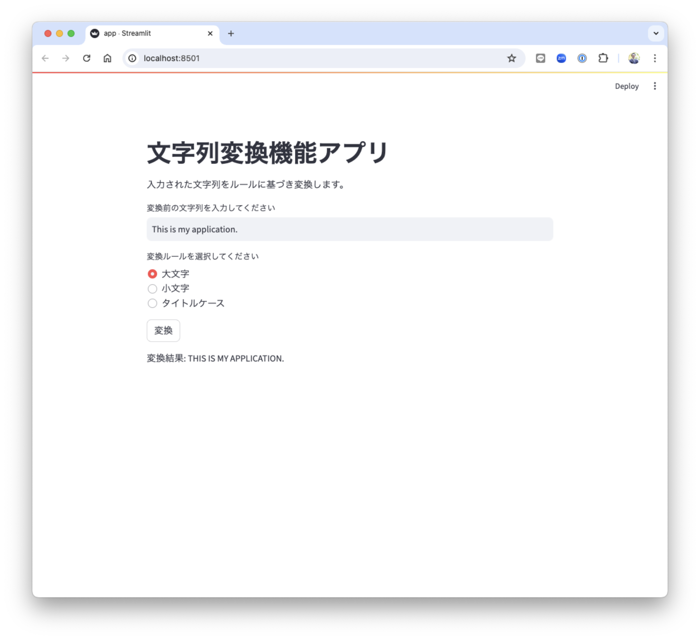

# Streamlitデモアプリ

- 名称: stlite-sample-0-demo
- 目的: Streamlitの最小限のサンプル用デモアプリ
- 機能: 入力された文字列をルールに従い変換する

このレポジトリは、XXXX用のサンプルデモアプリです。
Streamlitを簡単に動かしてみることができます。

## 機能詳細

- 文字列を入力
- 変換ルールをラジオボタンで選ぶ
- 変換ボタンをクリック
- 変換ルールに基づき変換された文字列を出力


## セットアップ

### 必須条件

- Python 3.8以上
- Streamlit 1.31以上

### 仮想環境

venvを用いてインストールを行います。
venvは、Pythonの標準ライブラリです。

https://docs.python.org/ja/3/tutorial/venv.html


```sh
% cd (任意のフォルダ)
% python3 -m venv venv
% source venv/bin/activate
```

### インストール

単体インストール

```sh
(venv) % pip install streamlit
```

GitHubからパッケージをダウンロードしてインストール（推奨）

```sh
(venv) % git clone git@github.com:terapyon-books/stlite-sample-0-demo.git
(venv) % stlite-sample-0-demo
(venv) % pip install -r requirements.txt
```

## 起動方法

```
(venv) % streamlit run app.py
```

## 表示確認

起動すると、デフォルトブラウザが立ち上がり表示確認ができる。

もし、ブラウザが立ち上がらない場合は、コンソールに表示されるポート付URLをブラウザで呼び出す。



# LICENCE

This package is under MIT License.
Please see `LICENSE` file.